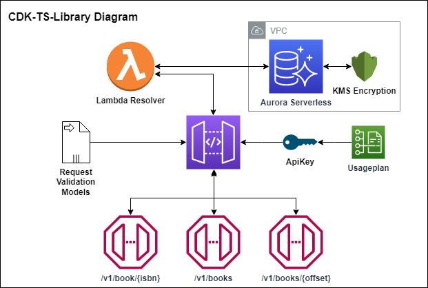

[](https://docs.aws.amazon.com/cdk/api/versions.html)
[](https://www.typescriptlang.org/download)
[](https://github.com/CodingWithFaruci/cdk-ts-library/actions)

# **CDK-TS-Library**

## **Content:**

* [Description](#description)
* [Get Started](#get-started)
  * [Steps](#steps)
    * [Create Table Command](#create-table-command)
  * [Operations](#operations)
* [Infrastructure](#infrastructure)
  * [cdk-ts-library contains the following AWS components](#cdk-ts-library-contains-the-following-aws-components)
* [Types](#types)
  * [IBook](#ibook)
  * [IPost](#ipost)
  * [IPatch](#ipatch)
  * [IFilter](#ifilter)
* [Useful commands](#useful-commands)

## **Description:**

    The cdk-ts-Library is an example project build with the AWS Cloud Development Kit (CDK) using TypeScript.
    The project contains a library api application using cloud native serverless components. 
    The project also contains:
    - Jest for unit testing
    - Postman for integration testing
    - ESLint for static code analysis
    - Webpack for compiling and compressing ts to js
    - GitHub Actions CI/CD workflows 

    The application features:
    - GET a single book with a given isbn.
    - GET multiple(10) books with given offset.
    - GET multiple(10) books with given filters and offset.
    - POST a single or multiple(10) books with given body.
    - PATCH a single book with given isbn and body.
    - DELETE a single book with given isbn.
    
    This project was made by @FarukAda.

# **Get Started:**

## **Steps:**

* Clone this repository by forking it to your own GitHub account.
* Store a Actions secret as AWS_ACCESS_KEY_ID with the value of your AWS acces key.
* Store a Actions secret as AWS_SECRET_ACCESS_KEY with the value of your AWS secret acces key.
* Merging a pull request into the main branch will trigger a GitHub Actions deployment workflow.
* After succesfull deployment, login to the database in the console using the secretArn in AWS Secrets.
* Run the create table command to create a table before executing api requests.
* For running the Postman integration tests:
  * Store a Actions secret as ENDPOINT with the value of the apigateway endpoint.
  * Store a Actions secret as X-API-Key with the value of the apigateway api key.
  * Trigger workflow manually.

### **Create Table Command:**

```SQL
CREATE TABLE library (
  isbn VARCHAR(50) UNIQUE NOT NULL,
  name VARCHAR(50) NOT NULL,
  authors VARCHAR(50)[] NOT NULL,
  languages VARCHAR(50)[] NOT NULL,
  countries VARCHAR(50)[] NOT NULL,
  numberOfPages integer,
  releaseDate VARCHAR(50) NOT NULL
)
```

## **Operations:**

|operation|method|pathParameters|querystringParameters|apiKey|body|
|-|-|-|-|-|-|
| getBook|`GET`|isbn: `string`|no|no|no|
| getBooks|`GET`|offset: `number`|no|no|no|
| getFilteredBooks|`GET`|offset: `number`|[IFilter](#ifilter)|no|no|
| postBooks|`POST`|no|no|yes|[IPost](#ipost)|
| patchBook|`PATCH`|isbn: `string`|no|yes|[IPatch](#ipatch)|
| deleteBook|`DELETE`|isbn: `string`|no|yes|no|

# **Infrastructure:**



## **cdk-ts-library contains the following AWS components:**

|Component|Description|
|-|-|
|**`VPC`**| virtual private cloud for placing database in|
|**`KMS`**| key used for encryption data at rest|
|**`Secrets`**| secret for storing the database password |
|**`Models`**| models used in validating request body|
|**`Validators`**| validates request body and parameters|
|**`ApiGateway`**| apigateway restendpoint for requests|
|**`Lambda`**| lambda function for resolving requests|
|**`AuroraDB`**| serverless aurora database with library table|
|**`ApiKey`**| api key used for admin methods|
|**`UsagePlan`**| usageplan for control over api key|

# **Types:**

## **IBook**

```TypeScript
interface IBook {
  isbn:string, 
  name:string, 
  authors:string[], 
  languages:string[], 
  countries:string[], 
  numberOfPages:number, 
  releaseDate:string,
}
```

## **IPost**

```TypeScript
interface IPost {
  books: IBook[]
}
```

## **IPatch**

```TypeScript
export interface IPatch {
  name:string, 
  authors:string[], 
  languages:string[], 
  countries:string[], 
  numberOfPages:number, 
  releaseDate:string,
}
```

## **IFilter**

```Typescript
interface IFilter {
  name?:string, 
  authors?:string[], 
  languages?:string[], 
  countries?:string[], 
  numberOfPages?:number, 
  releaseDate?:string,
}
```

# **Useful commands:**

| Command  | Description    |
|----------|----------------|
|`npm run build`|compile typescript to js|
|`npm run test`|perform the jest unit tests|
|`npm run lint`|perform static analyses on code|
|`cdk bootstrap`|bootstrap aws for cdk on first time using cdk|
|`cdk diff`|compare deployed stack with current state|
|`cdk synth`|emits the synthesized CloudFormation template|
|`cdk deploy`| deploy this stack to your default AWS account/region|
